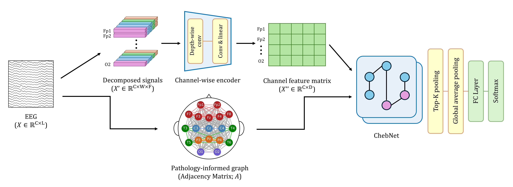
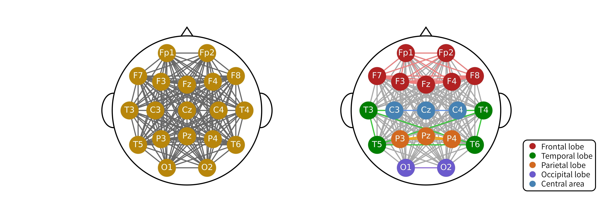

# Introduction
* AlCheNet = Pathology-informed Graph + Channel-wise encoder + ChebNet




# Setup
## Ubuntu setup
```
# Container setup
docker pull ubuntu:22.04
docker run -itd --gpus=all --shm-size --name <container_name> ubuntu:22.04

# Ubuntu setup
apt-get update
apt-get install sudo
sudo apt-get install git
git clone https://github.com/drawcodeboy/AlCheNet.git .

# Dataset
sudo apt-get install curl
sudo apt-get install unzip
curl -L -o ./data/open-nuro-dataset.zip https://www.kaggle.com/api/v1/datasets/download/yosftag/open-nuro-dataset
unzip data/open-nuro-dataset.zip -d data/open-nuro-dataset

# Python environment
sudo apt-get install python3
sudo apt-get install python3-venv
source .venv/bin/activate
pip install -r requirements.txt

# Data processing (Adjacency matrix(DTW), Nodes(Channel features))
python datasets/data2np.py

# Train & Test
python train.py --config=<config_name>
python test.py --config=<config_name>
```

# Result
